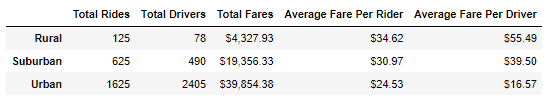

# PyBer Analysis
## Overview
This analysis serves to compare ride-sharing data between different city types - Rural, Suburban, and Urban.  We began with two datasets - one provided us with driver counts by city & city type.  The other was individual ride data which provided location and fare information.  By merging the two datasets we were able to discern the Total Rides, Total Drivers, Total Fares, Average Fare per Rider, and Average Fare per Driver.  We grouped these data by city type for analysis.

## Results

Predictably, there is a major difference amongst the city types with regards to Total Rides, Total Drivers, and Total Fares.  The interesting part of the analysis is that there is a negative correlation between the totals and the averages.  In Rural cities, the Average Fare Per Rider and Average Fare Per Driver are significantly higher than both Suburban and Urban cities.  This is due to 

## Summary
