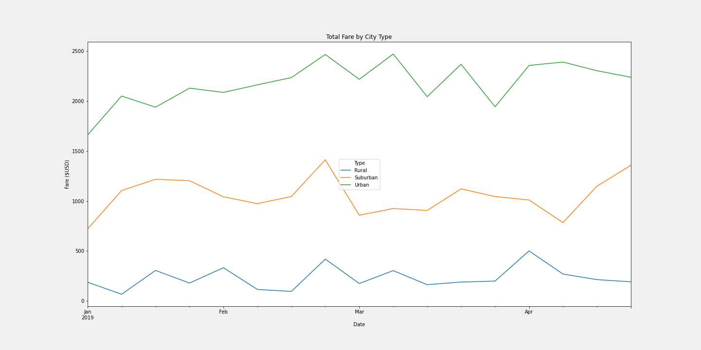

# PyBer Analysis
## Overview
This analysis serves to compare ride-sharing data between different city types - Rural, Suburban, and Urban.  We began with two datasets - one provided us with driver counts by city & city type.  The other was individual ride data which provided location and fare information.  By merging the two datasets we were able to discern the Total Rides, Total Drivers, Total Fares, Average Fare per Rider, and Average Fare per Driver.  We grouped these data by city type for analysis.

## Results

Predictably, there is a major difference amongst the city types with regards to Total Rides, Total Drivers, and Total Fares.  The interesting part of the analysis is that there is a negative correlation between the totals and the averages.  In Rural cities, the Average Fare Per Rider and Average Fare Per Driver are significantly higher than both Suburban and Urban cities.  This is due to a higher ratio of rides to drivers in Rural (~1.6 rides per driver) and Suburban (~1.2 rides per driver) cities than Urban (~0.7 rides per driver) cities.  After looking at these data by city type, we isolated all data from Q1 to compare Total Fares by week.

The trends between the city types have a vaguely similar shape, with all of the peaking the week of February 24th, which is a bit odd since there are no obvious holidays or events - this would be worth further investigation.  As reflected in the data frame, Urban cities consistently produce more fare revenue on a weekly basis than Suburban or Rural cities.

## Summary
Based on this analysis we recommend that an effort be made to generate both more drivers and more riders in Rural and Suburban cities.  The objective should be to have neither excess riders nor drivers - to bring the ratio as close to 1:1 as possible.  Likewise, efforts to recruit more drivers in Urban cities can be curtailed to improve the Average Fare per Rider and Average Fare per Driver in those cities.  Lastly, there could be incentives or notices offered to Urban drivers to try and move them from Urban cities to Suburban or Rural cities - let them know they'll be generating higher fares per ride and the driver supply may even itself out without having to onboard new drviers for smaller cities.
